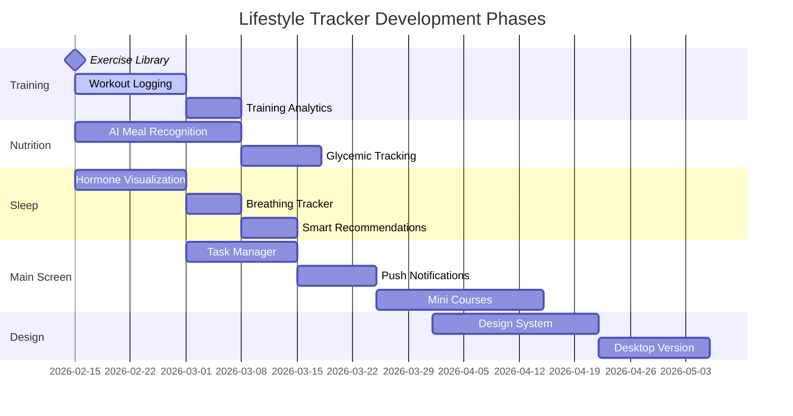
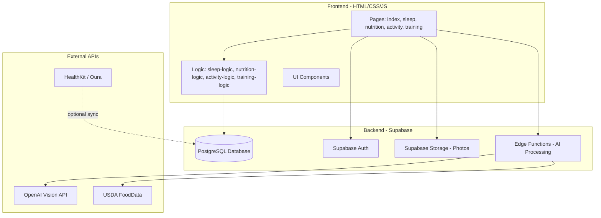

# Lifestyle Tracker - Product Roadmap

## Project Vision
Comprehensive personal health tracking with AI-powered insights, advanced analytics, and beautiful design.

---

## Feature Roadmap

### Phase 1: Training Diary (Workout Tracking)

**Status:** Planned

#### Features
1. **Exercise Library**
   - Add custom exercises
   - Pre-built exercise database (push, pull, legs, etc.)
   - Exercise categories and tags

2. **Workout Logging**
   - Track weights, sets, and reps for each exercise
   - Rest timer between sets
   - Track total training duration
   - Progressive overload tracking

3. **Training Analytics**
   - Personal records (PRs)
   - Volume tracking (weight × reps)
   - Strength progression graphs
   - Training frequency and consistency

**Database additions:**
- `exercises` table (user custom exercises)
- `workouts` table (training sessions)
- `workout_exercises` table (exercises performed in a workout)

---

### Phase 2: Nutrition Enhancements

**Status:** Partially Complete → Extending

#### Features
1. **Meal Photo Gallery** ✓ (Photo upload exists, needs enhancement)
   - Photo preview and editing
   - Gallery view of all meals
   - Photo history by date

2. **AI Meal Recognition**
   - OpenAI Vision API integration
   - Auto-detect foods in photos
   - Auto-fill nutrition data from image
   - Confidence scores and manual corrections

3. **Glycemic Index & Sugar Tracking**
   - Add GI (Glycemic Index) field to dishes
   - Sugar content tracking per meal
   - Blood glucose impact visualization
   - Insulin response patterns
   - Daily sugar intake tracking

**Database additions:**
- Add `sugar_grams` and `glycemic_index` fields to dishes
- Add `blood_glucose_readings` table (optional for manual glucose tracking)

**API integrations:**
- OpenAI Vision API (meal recognition)
- USDA FoodData Central or similar (nutrition database)

---

### Phase 3: Sleep & Hormone Optimization

**Status:** Basic Complete → Advanced Features

#### Features
1. **Hormone Correlations** (Currently: basic circadian analysis)
   - Visual hormone curves (GH, serotonin, melatonin, cortisol)
   - Sleep stage predictions based on bedtime
   - Optimal workout timing based on cortisol curve
   - Meal timing recommendations (insulin, ghrelin)

2. **Breathing & HRV Tracking**
   - Manual breathwork session logging
   - Integration with wearables (Apple Watch, Oura, Whoop)
   - HRV trends and recovery scores
   - Sleep quality correlation with HRV

3. **Smart Recommendations**
   - Bedtime suggestions based on patterns
   - Wake time optimization for sleep cycles
   - Sleep debt tracking
   - Caffeine cutoff recommendations

**Database additions:**
- Add `hrv_score`, `breathing_sessions` fields to sleep entries
- Add `recommendations` table (personalized suggestions)

**API integrations:**
- Apple HealthKit (optional)
- Oura API / Whoop API (optional)

---

### Phase 4: Main Screen Enhancements

**Status:** Basic Dashboard Exists → Major Upgrades

#### Features
1. **Task Manager**
   - Daily to-do lists
   - Habit tracking (water intake, meditation, etc.)
   - Streak tracking
   - Recurring tasks and reminders

2. **Push Notifications**
   - Meal reminders
   - Bedtime notifications
   - Workout reminders
   - Hydration reminders
   - Browser notification API + service workers

3. **Educational Content & Mini-Courses**
   - Bite-sized health tips
   - Weekly mini-lessons (sleep science, nutrition basics, etc.)
   - Progress-based unlocks
   - Resources library

4. **TBA / Future Ideas**
   - Social features (share progress with friends)
   - Weekly/monthly reports (PDF export)
   - Data export to Apple Health / Google Fit
   - Integration with fitness trackers

**Database additions:**
- `tasks` table (daily tasks and habits)
- `streaks` table (habit streaks)
- `content_library` table (educational content)
- `user_progress` table (course progress tracking)

---

### Phase 5: Design System & UI Overhaul

**Status:** Planned (Awaiting Detailed Specs)

#### Features
1. **Unique Design System**
   - Custom color palette and typography
   - Component library
   - Animation system
   - Dark mode support
   - User will provide specific design requirements

2. **Desktop Version**
   - Responsive layout for large screens
   - Multi-column layouts
   - Keyboard shortcuts
   - Desktop-optimized navigation
   - Charts and data visualizations

3. **Enhanced Photo Experience**
   - Full-screen photo viewer
   - Photo editing (crop, rotate, filters)
   - Before/after comparisons
   - Photo timeline and memories
   - Gallery view for dishes and meals

**Technical:**
- CSS custom properties for theming
- Responsive breakpoints
- Touch and mouse optimization
- Progressive Web App (PWA) for desktop install

---

## Implementation Priority



---

## Technical Architecture



---

## Database Schema Additions

### New Tables Needed

**Training/Workout:**
```sql
-- exercises: user's custom exercise library
-- workouts: training sessions
-- workout_exercises: exercises performed in each workout
-- personal_records: track PRs for each exercise
```

**Nutrition:**
```sql
-- Add to dishes: sugar_grams, glycemic_index
-- blood_glucose_readings (optional manual tracking)
```

**Sleep:**
```sql
-- Add to sleep_entries: hrv_score, breathing_quality
-- breathing_sessions: dedicated breathwork tracking
-- sleep_recommendations: AI-generated suggestions
```

**Main Screen:**
```sql
-- tasks: daily tasks and habits
-- streaks: habit streak tracking
-- content_library: educational content
-- user_progress: course completion tracking
-- notifications: notification history
```

---

## Quick Wins (High Impact, Low Effort)

1. **Training Diary Basic** - Similar to activity tracking, add exercises with sets/reps
2. **Dark Mode** - Use CSS variables, toggle in settings
3. **Weekly Summary View** - Aggregate last 7 days stats
4. **Export Data (JSON/CSV)** - Download button for backup

---

## Long-term Vision

1. **AI Health Coach** - Personalized recommendations based on your data patterns
2. **Wearable Integration** - Auto-sync from Apple Watch, Oura, Whoop
3. **Mobile App** - Progressive Web App or native (React Native)
4. **Community** - Share anonymized insights, compare with population averages
5. **Advanced Analytics** - Correlations between sleep, nutrition, performance

---

## Notes

- This is a living roadmap - priorities may shift based on user needs
- Each phase can be broken down into smaller iterations
- Focus on MVP (minimum viable product) for each feature before expanding
- Test thoroughly before moving to next phase
- Design system specs will be provided by user before Phase 5 starts

---

**Last Updated:** Feb 15, 2026
